# 🏙️ UrbanPulse — Smart Waste Management Platform

UrbanPulse is a full-stack, GIS-enabled smart municipal waste management ecosystem that coordinates **Citizens**, **Sanitation Workers**, and **Municipal Administrators** through automated workflows, spatial tracking, role-based controls, and AI-powered assistance.

---

## 📸 Interface Previews

### Landing Page & Live Impact


<p align="center">
  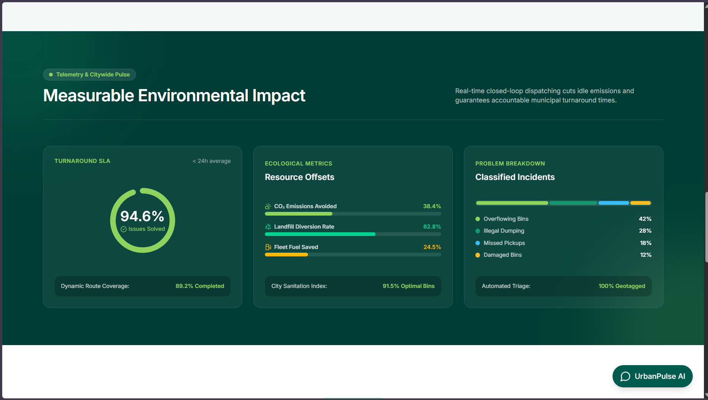
  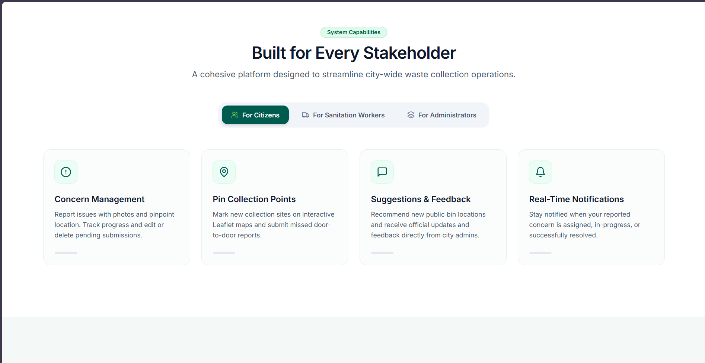
</p>

<p align="center">
  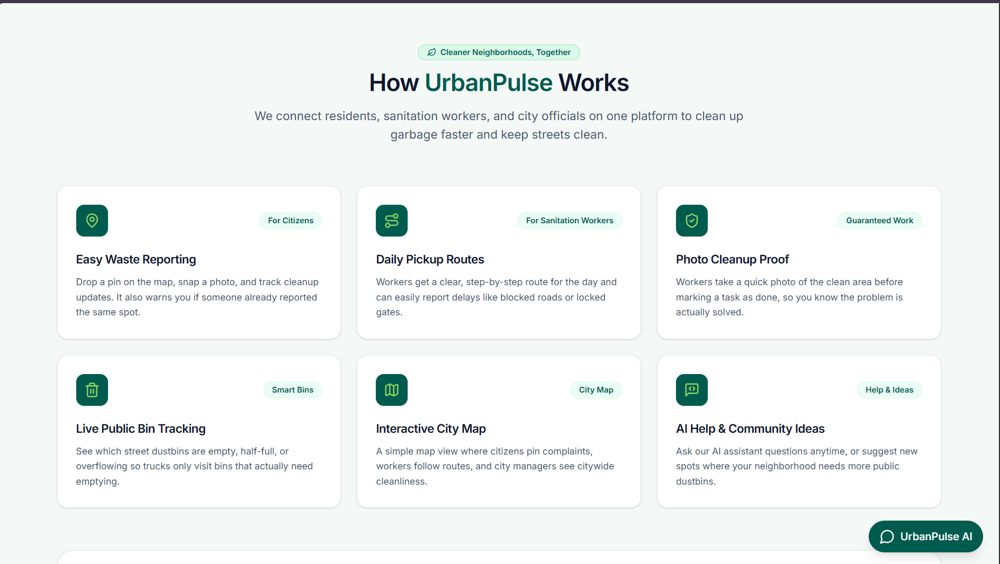
  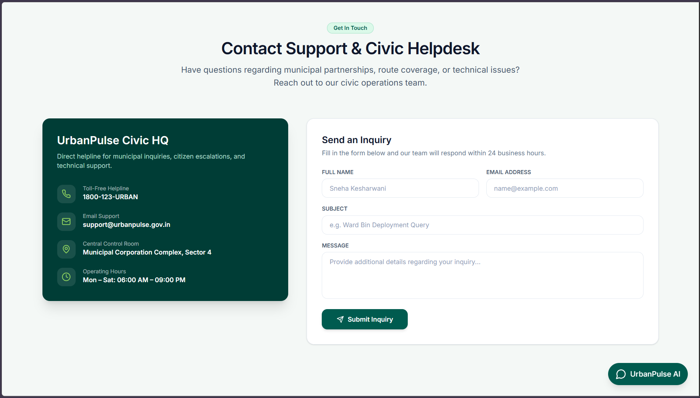
</p>

### Citizen Experience
<p align="center">
  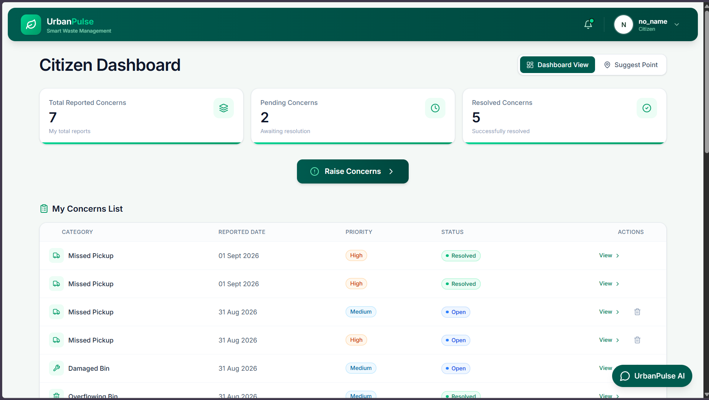
  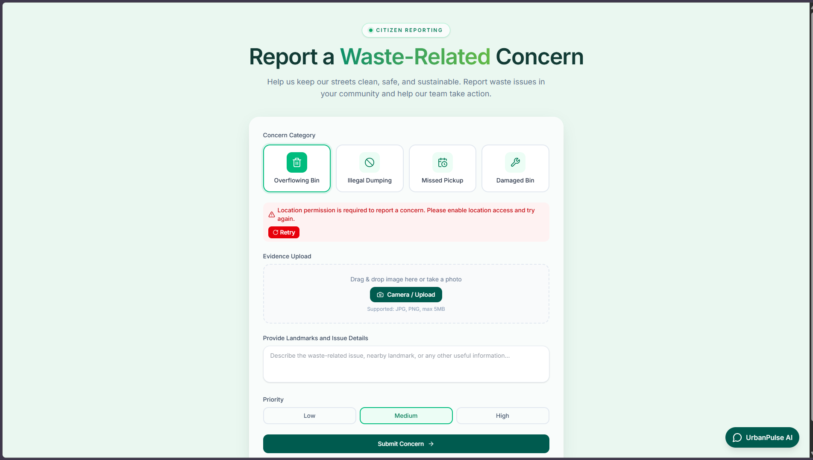
</p>
<p align="center">
  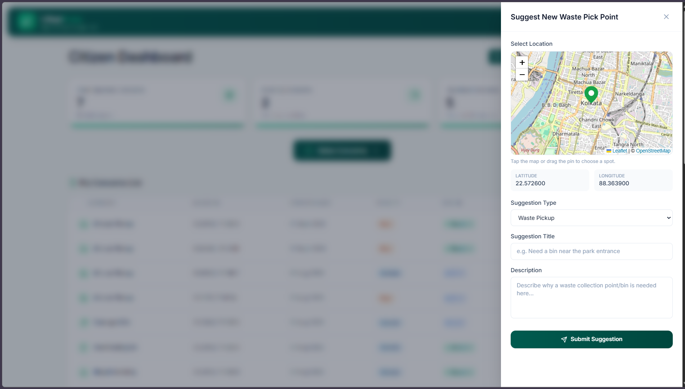
  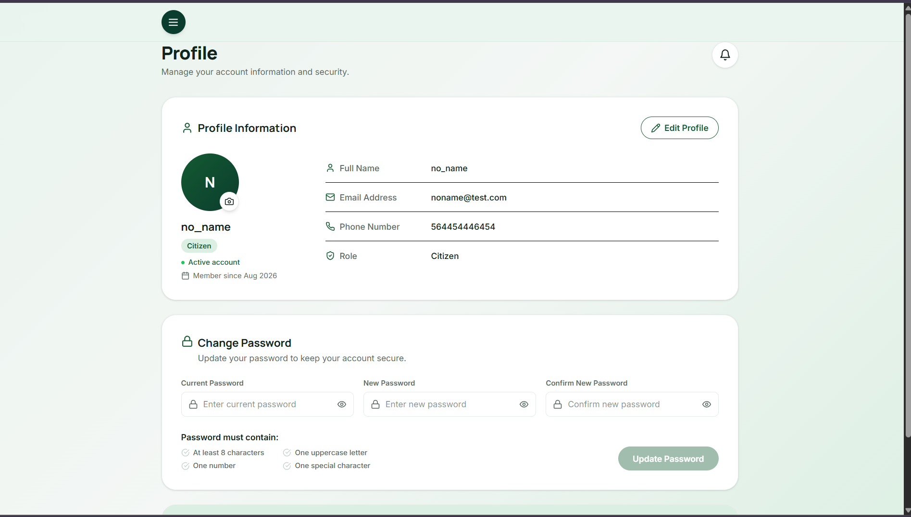
</p>

### Sanitation Worker Workspace
<p align="center">
  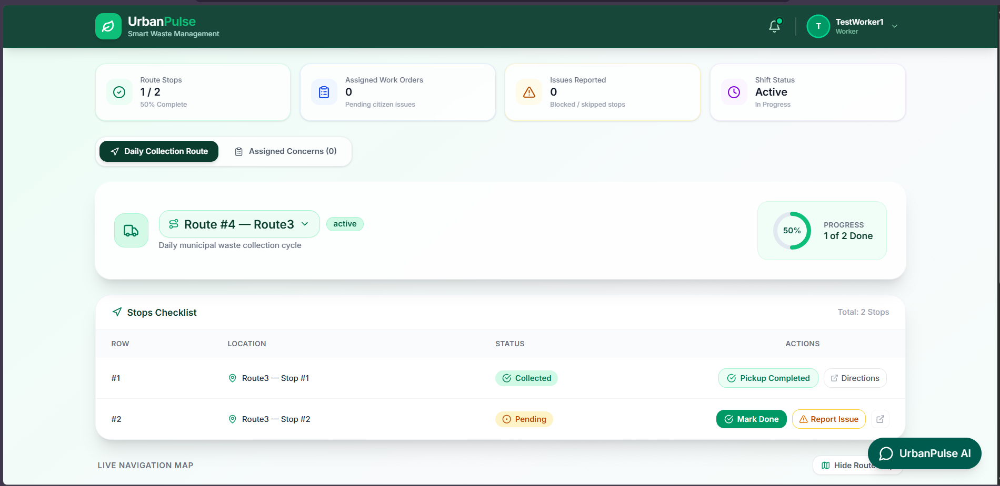
  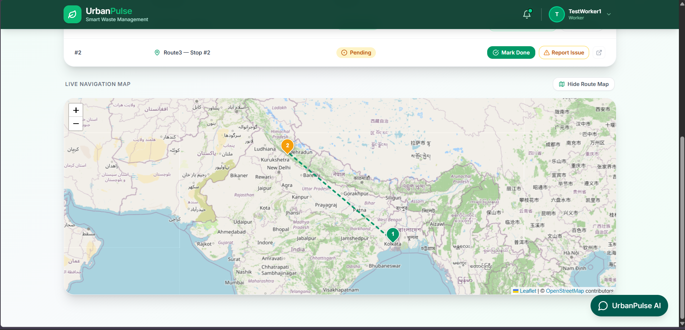
</p>
<p align="center">
  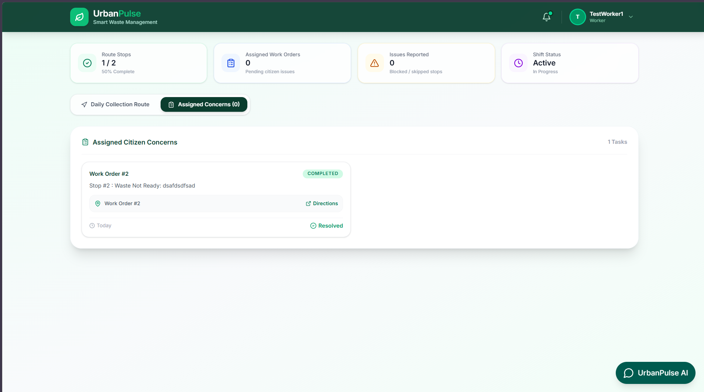
</p>

### Municipal Administrator Control Center
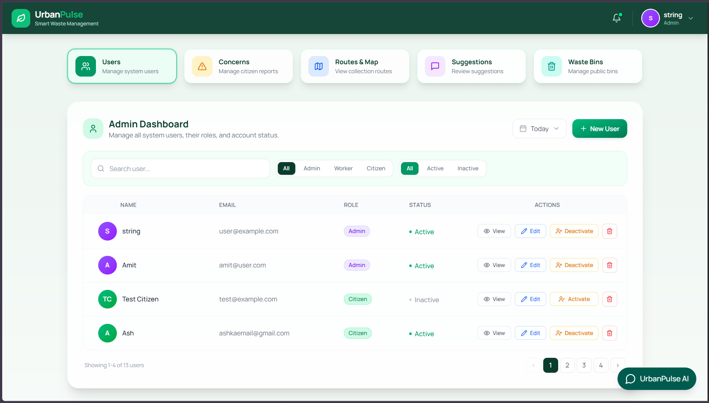

<p align="center">
  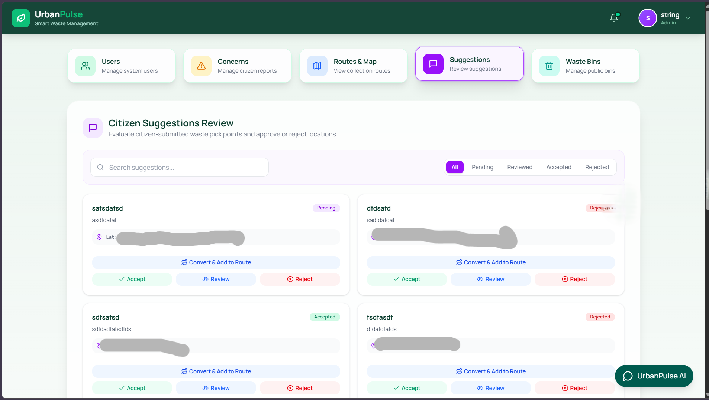
  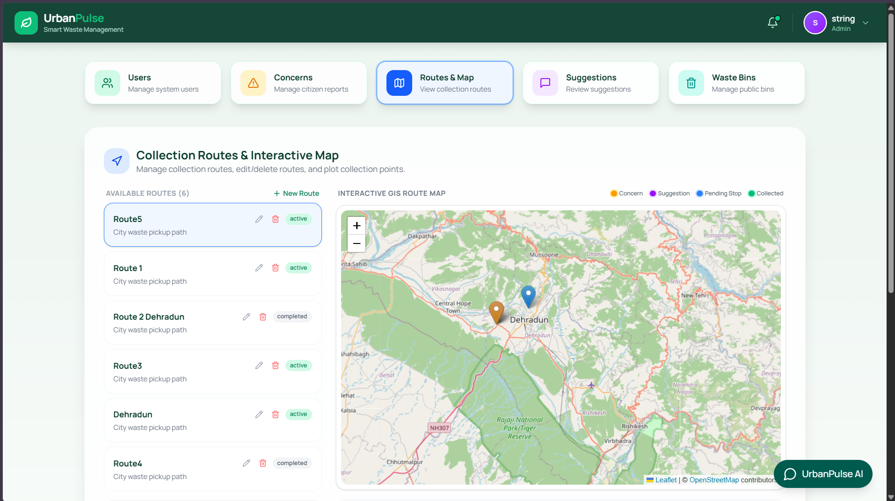
</p>
<p align="center">
  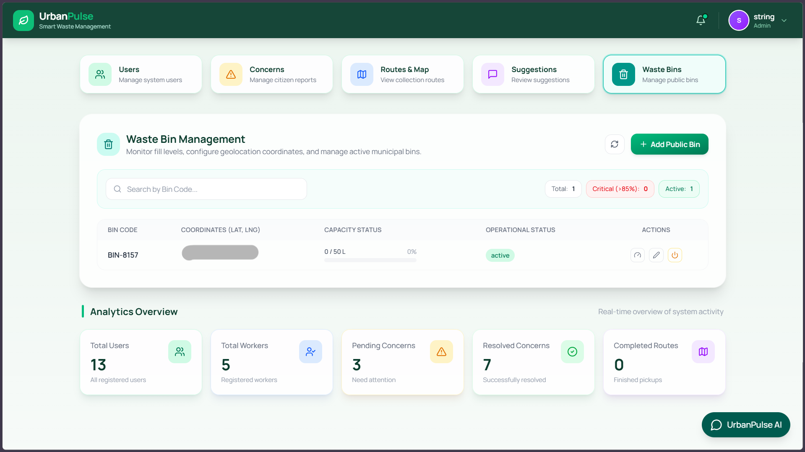
</p>

---

## Table of Contents

- [Overview](#overview)
- [Core Features](#core-features)
  - [Citizen Portal](#1-citizen-portal)
  - [Sanitation Worker Portal](#2-sanitation-worker-portal)
  - [Administrator Dashboard](#3-administrator-dashboard)
  - [AI Assistant](#4-ai-assistant)
- [System Architecture](#system-architecture)
- [Technology Stack](#technology-stack)
- [Repository Structure](#repository-structure)
- [Core Workflows](#core-workflows)
- [REST API](#rest-api)
- [Getting Started](#getting-started)
- [Environment Variables](#environment-variables)
- [Security](#security)
- [Database](#database)
- [Testing](#testing)
- [Documentation](#documentation)
- [Development Workflow](#development-workflow)
- [Design Principles](#design-principles)
- [Future Scope](#future-scope)
- [Project Status](#project-status)
- [License](#license)

---

## Overview

UrbanPulse addresses common problems in municipal waste management, including:

- Inefficient reporting of waste-related concerns
- Delayed assignment and resolution of civic issues
- Limited visibility into collection routes and collection points
- Difficulty monitoring public waste bins
- Fragmented communication between citizens and municipal authorities
- Limited operational analytics
- Lack of centralized location-aware waste-management information

The platform provides a role-based workflow:

```text
Citizens
   │
   ▼
Issue Reporting / Suggestions
   │
   ▼
Municipal Administration
   │
   ├── Triage & Prioritization
   ├── Worker Assignment
   └── Route Planning
           │
           ▼
   Sanitation Workers
           │
           ├── Collection
           ├── Concern Resolution
           └── Evidence Upload
           │
           ▼
        Resolution
           │
           ▼
   Citizen Notifications
```

---

# Core Features

## 1. Citizen Portal

Citizens can report neighborhood waste problems, suggest municipal improvements, and track the progress of their submissions.

### Concern Reporting

- Report geotagged waste-management concerns
- Select issue categories:
  - Illegal Dumping
  - Overflowing Bin
  - Missed Pickup
  - Damaged Bin
- Select a location using an interactive map or browser geolocation
- Upload supporting photo evidence
- Track concern status and resolution history
- Edit or delete concerns while they are pending
- Support existing nearby concerns

### Duplicate Detection

UrbanPulse performs proximity-based duplicate checking for active concerns.

```text
Citizen submits concern
        │
        ▼
Proximity + category check
        │
   ┌────┴────┐
   │         │
Duplicate   New
   │         │
   ▼         ▼
Support     Create
existing    concern
concern     (Pending)
```

This reduces duplicate reports and allows citizens to increase community support for an existing issue.

### Concern Lifecycle

```text
Pending → In Progress → Resolved
```

### Suggestions

Citizens can submit suggestions for:

- New public waste bins
- New recurring collection points
- Waste-management infrastructure
- General civic improvements

Suggestion statuses include:

```text
Pending → Under Review → Approved / Rejected
```

### Notifications & Dashboard

The citizen dashboard provides:

- Total reported concerns
- Pending concerns
- Resolved concerns
- Personal concern history
- Suggestion history
- Notification inbox
- Assignment and resolution updates
- Suggestion review feedback

---

## 2. Sanitation Worker Portal

The worker portal supports daily collection operations and resolution of assigned citizen concerns.

### Daily Route Management

Workers can:

- View assigned collection routes
- View ordered collection stops
- Navigate routes through an interactive map
- Monitor route execution progress
- Use Google Maps navigation for individual locations

### Collection Point Execution

Workers can:

- Mark collection points as collected
- Report unsuccessful collection attempts
- Record operational failure reasons:
  - House Locked
  - Waste Not Ready
  - Road Blocked
  - Vehicle Issue
  - Other

Collection-state changes are reflected in the route map.

### Citizen Concern Assignments

Workers can:

- View assigned concerns
- Accept assigned work orders
- Move assignments from `Assigned` to `In Progress`
- Complete field work
- Upload resolution evidence
- Mark assigned work as completed

Resolution evidence is used to maintain an auditable record of the work performed.

### Worker Dashboard

The worker dashboard provides:

- Daily route summary
- Collection progress
- Pending assignments
- Completed assignments
- Notifications
- Operational status

---

## 3. Administrator Dashboard

Administrators have centralized control over users, concerns, workers, routes, collection points, waste bins, suggestions, and analytics.

### User & Staff Management

Administrators can:

- View and search users
- Filter users by role
- Create worker and administrator accounts
- Update user details
- Activate or deactivate accounts
- Soft-delete decommissioned accounts

### Concern Management

Administrators can:

- View and filter city-wide concerns
- Inspect reporter information and evidence
- Review concern locations
- Assign priorities
- Assign workers
- Reject invalid reports
- Add concern coordinates to route planning
- Override concern status when necessary

Supported priorities:

```text
Low
Medium
High
```

Supported concern statuses:

```text
Pending
In Progress
Resolved
```

### Route & Collection Point Management

Administrators can:

- Create collection routes
- Assign routes to workers
- Add collection points
- Edit collection points
- Delete collection points
- Reorder collection stops
- Add coordinates through an interactive map
- Use concerns and suggestions as contextual planning data

### Waste Bin Management

Administrators can:

- Register public waste bins
- Set bin coordinates and capacity information
- Monitor fill levels
- Update bin metadata
- Activate or deactivate bins
- Monitor operational status

Supported operational states include:

```text
Empty
Half Full
Full
Overflowing
Damaged
```

### Suggestion Management

Administrators can:

- Review citizen suggestions
- Filter suggestions by type
- Approve or reject suggestions
- Mark suggestions under review
- Provide administrative feedback
- Convert approved coordinates into collection points or route-planning data

### Analytics

The administrator dashboard provides operational analytics for:

- Users
- Workers
- Concerns
- Concern categories
- Concern priorities
- Routes
- Collection points
- Waste bins
- Resolution performance
- Public operational impact

---

## 4. AI Assistant

UrbanPulse includes an AI-powered **Retrieval-Augmented Generation (RAG)** assistant for civic and waste-management support.

The assistant can answer questions about:

- Waste-management guidelines
- Concern reporting
- Platform usage
- Civic procedures
- Municipal waste-management information

### RAG Architecture

```text
User Query
    │
    ▼
Query Processing
    │
    ▼
Embedding Generation
    │
    ▼
ChromaDB Retrieval
    │
    ▼
Relevant Knowledge
    │
    ▼
Context Construction
    │
    ▼
OpenAI Model
    │
    ▼
AI Response
```

The chatbot service contains:

- Knowledge-document ingestion
- Text splitting
- Embedding generation
- Vector storage
- Retrieval
- Context construction
- Prompt management
- LLM provider integration
- API endpoints
- RAG tests

---

# System Architecture

UrbanPulse consists of a React frontend, FastAPI backend, PostgreSQL database, image-storage integration, and a separate RAG chatbot service.

```text
                         ┌──────────────────────┐
                         │       Citizens       │
                         └──────────┬───────────┘
                                    │
                         ┌──────────▼───────────┐
                         │    React Frontend    │
                         │   React + Vite + GIS │
                         └──────────┬───────────┘
                                    │ REST API
                         ┌──────────▼───────────┐
                         │    FastAPI Backend    │
                         │ Authentication / RBAC │
                         │    Business Logic     │
                         └───────┬───────┬──────┘
                                 │       │
                    ┌────────────▼───┐ ┌─▼────────────────┐
                    │   PostgreSQL   │ │  Chatbot / RAG   │
                    │    Database    │ │     Service      │
                    └────────────────┘ └────────┬─────────┘
                                                │
                                         ┌──────▼──────┐
                                         │   ChromaDB  │
                                         │ Vector Store│
                                         └─────────────┘

                         Image Evidence
                               │
                               ▼
                          Cloudinary
```

---

# Technology Stack

## Frontend

| Technology | Purpose |
|---|---|
| React 18 | User interface |
| Vite | Frontend build tooling |
| JavaScript / JSX | Application development |
| Tailwind CSS | Styling |
| Framer Motion | Animations |
| Lucide React | Icons |
| React Router | Client-side routing |
| Axios | HTTP requests |
| React-Leaflet | Interactive maps |
| Leaflet | GIS/map rendering |
| Recharts | Data visualization |
| Browser Geolocation API | Location access |

## Backend

| Technology | Purpose |
|---|---|
| Python 3.10+ | Backend runtime |
| FastAPI | REST API framework |
| SQLAlchemy | ORM |
| Pydantic v2 | Data validation |
| PostgreSQL | Relational database |
| Alembic | Database migrations |
| JWT | Authentication |
| bcrypt | Password hashing |

## AI / Chatbot

| Technology | Purpose |
|---|---|
| Python | AI service |
| OpenAI | Language-model provider |
| ChromaDB | Vector database |
| Sentence Transformers | Embeddings |
| RAG | Context-aware retrieval and generation |

## Image Storage

| Technology | Purpose |
|---|---|
| Cloudinary | Concern evidence storage |
| Multipart uploads | Image transfer |
| Image validation | Upload protection |

## Development Tools

- Git
- GitHub
- VS Code
- Swagger / OpenAPI
- Postman
- Python virtual environments
- npm

---

# Repository Structure

```text
Urban-Pulse/
│
├── urbanpulse-backend/
│   ├── app/
│   │   ├── api/
│   │   │   └── v1/
│   │   │       ├── analytics.py
│   │   │       ├── assignments.py
│   │   │       ├── auth.py
│   │   │       ├── chatbot.py
│   │   │       ├── collection_points.py
│   │   │       ├── collection_routes.py
│   │   │       ├── concerns.py
│   │   │       ├── concern_images.py
│   │   │       ├── dashboard.py
│   │   │       ├── maps.py
│   │   │       ├── notifications.py
│   │   │       ├── profile.py
│   │   │       ├── suggestions.py
│   │   │       ├── user.py
│   │   │       └── waste_bins.py
│   │   ├── core/
│   │   ├── db/
│   │   ├── dependencies/
│   │   ├── middleware/
│   │   ├── models/
│   │   ├── prompts/
│   │   ├── providers/
│   │   ├── schemas/
│   │   ├── scripts/
│   │   ├── services/
│   │   ├── static/
│   │   ├── utils/
│   │   └── main.py
│   ├── alembic/
│   ├── tests/
│   ├── requirements.txt
│   └── run.py
│
├── urbanpulse-frontend/
│   ├── src/
│   │   ├── api/
│   │   ├── assets/
│   │   ├── components/
│   │   │   ├── admin/
│   │   │   ├── common/
│   │   │   ├── report-concern/
│   │   │   └── worker/
│   │   ├── pages/
│   │   ├── App.jsx
│   │   ├── main.jsx
│   │   └── index.css
│   ├── tailwind.config.js
│   └── package.json
│
├── urbanpulse-chatbot/
│   ├── app/
│   │   ├── api/
│   │   ├── config/
│   │   ├── core/
│   │   ├── models/
│   │   ├── prompts/
│   │   ├── providers/
│   │   ├── rag/
│   │   ├── repositories/
│   │   ├── schemas/
│   │   └── services/
│   ├── data/
│   │   ├── chroma/
│   │   ├── knowledge/
│   │   └── uploads/
│   ├── scripts/
│   ├── tests/
│   ├── requirements.txt
│   ├── test_chromadb.py
│   ├── test_rag_service.py
│   └── README.md
│
├── urbanpulse-docs/
│   ├── api.md
│   ├── database_models.md
│   ├── features.md
│   ├── project_structure.md
│   ├── SRS.pdf
│   ├── urban_pulse_erd.png
│   └── urban_pulse_physical_erd.jpeg
│
├── README.md
└── .gitignore
```

---

# Core Workflows

## Concern Reporting & Resolution

```text
Citizen
   │
   ▼
Submit Concern
(Category + Description + Location + Evidence)
   │
   ▼
Duplicate Detection
   │
   ├── Duplicate → Support Existing Concern
   │
   └── New Concern
          │
          ▼
       Pending
          │
          ▼
    Admin Review
          │
          ▼
   Worker Assignment
          │
          ▼
    In Progress
          │
          ▼
 Worker Resolves Issue
 + Uploads Evidence
          │
          ▼
       Resolved
          │
          ▼
 Citizen / Admin Notification
```

## Collection Workflow

```text
Admin
 │
 ├── Creates Route
 ├── Adds Collection Points
 └── Assigns Worker
        │
        ▼
     Worker
        │
        ├── Views Route
        ├── Navigates to Stop
        ├── Marks Collected
        └── Reports Exception
```

## Waste Bin Workflow

```text
Admin Registers Bin
        │
        ▼
Location + Capacity + Status
        │
        ▼
Fill Level Updates
(Admin / Worker / IoT integration)
        │
        ▼
Monitoring & Analytics
```

---

# REST API

The backend exposes a versioned REST API under:

```text
/api/v1
```

The current API is documented in [`urbanpulse-docs/api.md`](urbanpulse-docs/api.md).

## API Overview

| Resource | Main Operations |
|---|---|
| Authentication | Register, login, refresh, logout, current user |
| Users | Create, list, update, activate/deactivate, delete |
| Profile | View and update profile/password |
| Concerns | Create, list, update, delete, status, history, support |
| Concern Images | Upload, list, delete evidence |
| Assignments | Create, list, view, update status |
| Collection Routes | Create, list, view, update, delete, status |
| Collection Points | Create, list, view, update, delete, collect |
| Waste Bins | Create, list, view, update, fill level, activation |
| Suggestions | Citizen submission and admin review |
| Notifications | List and read notifications |
| Dashboards | Citizen, worker, and admin dashboards |
| Analytics | Operational and performance metrics |
| Maps | Nearby bins, concerns, and collection points |
| Chatbot | AI/RAG query endpoint |

## Important Endpoints

### Authentication

```text
POST /api/v1/auth/register
POST /api/v1/auth/login
POST /api/v1/auth/refresh
POST /api/v1/auth/logout
GET  /api/v1/auth/me
```

### Concerns

```text
GET    /api/v1/concerns/
POST   /api/v1/concerns/
GET    /api/v1/concerns/{concern_id}
PUT    /api/v1/concerns/{concern_id}
DELETE /api/v1/concerns/{concern_id}
PATCH  /api/v1/concerns/{concern_id}/status
GET    /api/v1/concerns/{concern_id}/history
POST   /api/v1/concerns/{concern_id}/support
DELETE /api/v1/concerns/{concern_id}/support
```

### Assignments

```text
GET   /api/v1/assignments
POST  /api/v1/assignments
GET   /api/v1/assignments/{assignment_id}
PATCH /api/v1/assignments/{assignment_id}/status
```

### Collection Routes

```text
GET    /api/v1/collection-routes
POST   /api/v1/collection-routes
GET    /api/v1/collection-routes/{route_id}
PATCH  /api/v1/collection-routes/{route_id}
PATCH  /api/v1/collection-routes/{route_id}/status
DELETE /api/v1/collection-routes/{route_id}
```

### Collection Points

```text
GET    /api/v1/collection-points
POST   /api/v1/collection-points
GET    /api/v1/collection-points/route/{route_id}
GET    /api/v1/collection-points/{point_id}
PATCH  /api/v1/collection-points/{point_id}
PATCH  /api/v1/collection-points/{point_id}/collect
DELETE /api/v1/collection-points/{point_id}
```

### Waste Bins

```text
GET   /api/v1/waste-bins
POST  /api/v1/waste-bins
GET   /api/v1/waste-bins/{waste_bin_id}
PATCH /api/v1/waste-bins/{waste_bin_id}
PATCH /api/v1/waste-bins/{waste_bin_id}/fill-level
PATCH /api/v1/waste-bins/{waste_bin_id}/activate
PATCH /api/v1/waste-bins/{waste_bin_id}/deactivate
```

### Maps

```text
GET /api/v1/maps/nearby-bins
GET /api/v1/maps/nearby-concerns
GET /api/v1/maps/nearby-collection-points
```

### Dashboards

```text
GET /api/v1/dashboard/admin
GET /api/v1/dashboard/worker
GET /api/v1/dashboard/citizen
```

### Analytics

```text
GET /api/v1/analytics/overview
GET /api/v1/analytics/workers
GET /api/v1/analytics/concerns/status
GET /api/v1/analytics/concerns/categories
GET /api/v1/analytics/concerns/priorities
GET /api/v1/analytics/routes/status
GET /api/v1/analytics/collection-points/status
GET /api/v1/analytics/waste-bins/status
GET /api/v1/analytics/analytics/public-impact
```

### Chatbot

```text
POST /api/v1/chatbot/ask
```

## Interactive API Documentation

When the backend is running:

```text
Swagger UI:
http://localhost:8000/docs

ReDoc:
http://localhost:8000/redoc
```

The generated OpenAPI specification should be treated as the source of truth for the exact API contract.

---

# Getting Started

## Prerequisites

Install:

- Node.js 18+
- Python 3.10+
- PostgreSQL 14+
- Git

---

## 1. Backend Setup

Navigate to the backend:

```bash
cd urbanpulse-backend
```

Create a virtual environment:

```bash
python -m venv .venv
```

### Linux / macOS

```bash
source .venv/bin/activate
```

### Windows

```powershell
.venv\Scripts\activate
```

Install dependencies:

```bash
pip install -r requirements.txt
```

Create a PostgreSQL database named `urbanpulse_db`, then configure the environment variables described below.

Apply migrations:

```bash
alembic upgrade head
```

Start the backend:

```bash
uvicorn app.main:app --reload --port 8000
```

Backend:

```text
http://localhost:8000
```

---

## 2. Frontend Setup

Open a new terminal:

```bash
cd urbanpulse-frontend
```

Install dependencies:

```bash
npm install
```

Create the frontend environment file:

```env
VITE_API_BASE_URL=http://localhost:8000/api/v1
```

Start the development server:

```bash
npm run dev
```

Frontend:

```text
http://localhost:5173
```

---

## 3. Chatbot Service Setup

Open another terminal:

```bash
cd urbanpulse-chatbot
```

Install dependencies:

```bash
pip install -r requirements.txt
```

Run the ChromaDB verification:

```bash
python test_chromadb.py
```

Run the RAG service verification:

```bash
python test_rag_service.py
```

Start the chatbot according to its configured application entrypoint.

---

# Environment Variables

## Backend

Create `urbanpulse-backend/.env`:

```env
DATABASE_URL=postgresql+psycopg2://<user>:<password>@localhost:5432/urbanpulse_db

SECRET_KEY=your_super_secret_jwt_key
ALGORITHM=HS256
ACCESS_TOKEN_EXPIRE_MINUTES=1440

CLOUDINARY_CLOUD_NAME=
CLOUDINARY_API_KEY=
CLOUDINARY_API_SECRET=
CLOUDINARY_FOLDER=urbanpulse/concerns

MAX_IMAGE_SIZE_BYTES=5242880
```

The default maximum concern-image size is **5 MB**.

## Frontend

Create `urbanpulse-frontend/.env`:

```env
VITE_API_BASE_URL=http://localhost:8000/api/v1
```

## Chatbot

The chatbot may require configuration such as:

```env
API_HOST=0.0.0.0
API_PORT=8000

OPENAI_API_KEY=
OPENAI_MODEL=gpt-3.5-turbo
EMBEDDING_MODEL=text-embedding-3-large

DEBUG=False
ENVIRONMENT=development
```

Use the actual configuration expected by the chatbot service in the repository.

> **Never commit `.env` files, API keys, database passwords, JWT secrets, or Cloudinary credentials to Git.**

---

# Security

UrbanPulse uses several security mechanisms.

## Authentication

- JWT access tokens
- Refresh-token mechanism
- HTTP-only refresh-token cookie
- Token rotation
- Logout/session revocation

## Authorization

Role-Based Access Control is applied to:

```text
Citizen
Worker
Admin
```

Protected endpoints verify both authentication and the user's role before performing restricted operations.

## Password Security

Passwords are hashed using **bcrypt** and are never stored as plaintext.

## Image Security

Concern images are:

- Validated before storage
- Size-limited
- Stored through Cloudinary
- Associated with individual concerns

Evidence-upload permissions are restricted according to the concern workflow and backend RBAC rules.

---

# Database

UrbanPulse uses PostgreSQL with SQLAlchemy.

Major domain entities include:

- User
- Waste Bin
- Concern
- Concern Image
- Concern Support
- Concern History
- Assignment
- Collection Route
- Collection Point
- Suggestion
- Notification
- Refresh Token

Database schema changes are managed through Alembic migrations.

```text
Application
    │
    ▼
SQLAlchemy ORM
    │
    ▼
PostgreSQL
```

Detailed database information is available in:

```text
urbanpulse-docs/database_models.md
```

---

# Testing

Testing should cover both backend functionality and the chatbot/RAG system.

## Backend

Recommended coverage includes:

- Authentication
- Authorization
- RBAC
- CRUD operations
- Concern workflows
- Duplicate concern detection
- Image uploads
- Assignments
- Collection routes
- Collection points
- Waste bins
- Suggestions
- Notifications
- Dashboards
- Analytics
- Maps
- Chatbot integration

## Chatbot

The chatbot contains tests for areas including:

- ChromaDB integration
- RAG retrieval
- AI functionality
- Service behavior
- Image-related services where applicable

---

# Documentation

Additional documentation is maintained under:

```text
urbanpulse-docs/
```

| File | Description |
|---|---|
| `api.md` | Detailed REST API documentation |
| `database_models.md` | Database models, relationships, and data dictionary |
| `features.md` | Functional feature specifications |
| `project_structure.md` | Architecture and directory documentation |
| `SRS.pdf` | Software Requirements Specification |
| `urban_pulse_erd.png` | Entity Relationship Diagram |
| `urban_pulse_physical_erd.jpeg` | Physical ER Diagram |

> The current backend source code and generated OpenAPI documentation should be treated as the source of truth for implemented API behavior. Supporting documentation may change as the project evolves.

---

# Development Workflow

A typical local development environment uses three services.

### Terminal 1 — Backend

```bash
cd urbanpulse-backend
source .venv/bin/activate
uvicorn app.main:app --reload --port 8000
```

On Windows, activate the virtual environment using:

```powershell
.venv\Scripts\activate
```

### Terminal 2 — Frontend

```bash
cd urbanpulse-frontend
npm run dev
```

### Terminal 3 — Chatbot

```bash
cd urbanpulse-chatbot
```

Run the chatbot using its configured entrypoint.

The frontend communicates with the FastAPI backend, while the backend integrates with the chatbot service for AI-powered civic assistance.

---

# Design Principles

UrbanPulse follows a modular backend architecture:

```text
API Routes
    │
    ▼
Dependencies / RBAC
    │
    ▼
Services
    │
    ▼
Models / Database
```

Supporting layers include:

- Pydantic schemas
- Authentication dependencies
- Role dependencies
- Middleware
- Utility functions
- External-service providers
- Image-storage integration
- AI/RAG services

This separation keeps business logic independent from transport, persistence, and external integrations, making the system easier to test and extend.

---

# Future Scope

Potential extensions include:

- Real-time GPS tracking of sanitation vehicles
- IoT-based automatic waste-bin fill sensors
- Automated route optimization
- Predictive waste-generation analytics
- Ward-level GIS heatmaps
- Dedicated mobile applications
- Offline worker functionality
- Multilingual AI civic assistance
- Automated concern prioritization
- AI/computer-vision-based waste classification
- Push, SMS, and email notifications
- Predictive overflow detection
- QR-based waste-bin identification
- Automated collection scheduling
- Advanced municipal performance monitoring

---

# Project Status

UrbanPulse is an actively developed full-stack project.

Current system capabilities include:

- Role-based authentication
- Citizen, Worker, and Admin workflows
- Concern reporting and management
- Geolocation and map-based operations
- Duplicate concern detection
- Community concern support
- Image evidence
- Cloudinary integration
- Worker assignments
- Collection routes
- Collection points
- Waste-bin management
- Notifications
- Citizen suggestions
- Role-specific dashboards
- Administrative analytics
- Nearby-resource APIs
- AI chatbot
- RAG infrastructure
- PostgreSQL database architecture
- React frontend

---

# License

This project is intended for educational, development, and demonstration purposes unless a separate license is provided by the project owners.

If the repository contains a `LICENSE` file, that file is the authoritative source for the project's licensing terms.

---

## UrbanPulse

**Report. Connect. Collect. Improve.**

A centralized approach to smarter, more transparent, and more connected urban waste management.
